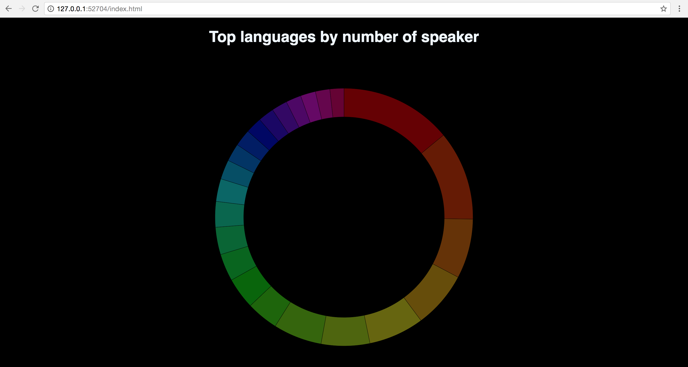

# Assessment 1
We had to make a chart with some data we got.

## Background
I started with creating a piechart. 
When finally understanding the code, I started adding a transition and a hover.
The final step was adding labels in the middle of the circle.
That took me some time but a great tutorial helped me with it (see licence)

## Data
The data I used is from a TSV (tab seperated values)
The top 3 is missing because they are too common.

<table>
  <tr>
    <th>language</th>
    <th>speakers</th>
  </tr>
  <tr>
    <td>Spanish</td>
    <td>527000000</td>
  <tr>
    <td>Arabic</td>
    <td>422000000</td>
  </tr>
  <tr>
    <td>Malay</td>
    <td>281000000</td>
  </tr>
  <tr>
    <td>Russian</td>
    <td>267000000</td>
  </tr>
  <tr>
    <td>Bengali</td>
    <td>261000000</td>
  </tr>
  <tr>
    <td>Portuguese</td>
    <td>229000000</td>
  </tr>
  <tr>
    <td>French</td>
    <td>229000000</td>
  </tr>
    <tr>
    <td>Hausa</td>
    <td>150000000</td>
  </tr>
  <tr>
    <td>Punjabi</td>
    <td>148000000</td>
  </tr>
  <tr>
    <td>Japanese</td>
    <td>129000000</td>
  </tr>
  <tr>
    <td>German</td>
    <td>129000000</td>
  </tr>
  <tr>
    <td>Persian</td>
    <td>121000000</td>
  </tr>
  <tr>
    <td>Shahili</td>
    <td>107000000</td>
  </tr>
      <tr>
    <td>Telugu</td>
    <td>92000000</td>
  </tr>
  <tr>
    <td>Javanese</td>
    <td>84000000</td>
  </tr>
  <tr>
    <td>Wu Chinese</td>
    <td>80000000</td>
  </tr>
  <tr>
    <td>Korean</td>
    <td>77000000</td>
  </tr>
  <tr>
    <td>Tamil</td>
    <td>75000000</td>
  </tr>
  <tr>
    <td>Marathi</td>
    <td>74000000</td>
  </tr>  
  <tr>
    <td>Yue Chinese</td>
    <td>72000000</td>
  </tr>
  <tr>
    <td>Turkish</td>
    <td>71000000</td>
  </tr>
  <tr>
    <td>Vietnamese</td>
    <td>68000000</td>
  </tr>
  <tr>
    <td>Italian</td>
    <td>66000000</td>
  </tr>
</table>

## Features
`d3.scaleOrdinal` to make a ordinal scale  
`d3.arc` to make the arc  
`d3.pie` to make the pie itself  
`d3.select` to select things from d3  
`d3.append` append objects  

## Licence
The MIT License (MIT) 
 
Copyright (c) 2017 Kevin Goldstein.  
 
thanks to:  
http://bl.ocks.org/juan-cb/1984c7f2b446fffeedde - Juan Cruz-Benito. http://juancb.es 
